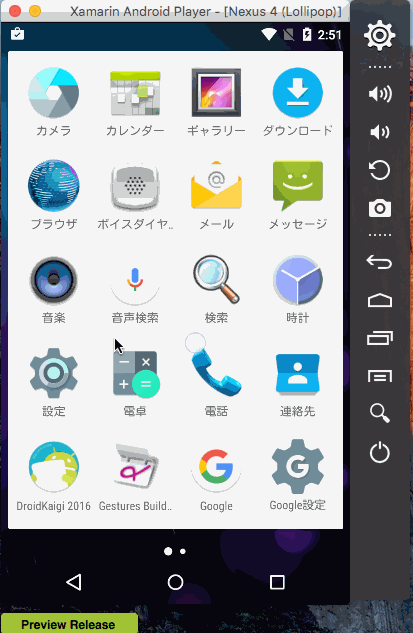

# Screens

# Libraries

* Dagger2 -> [Stiletto](http://stiletto.bendb.com/) - Benjamin Bader
* Retrofit2 -> [Refit](https://github.com/paulcbetts/refit) - paulcbetts
* Picasso -> [Picasso](https://www.nuget.org/packages/Square.Picasso) - mattleibow
* OkHttp3 -> N/A
* Android-Orma -> [Akavache](https://github.com/akavache/Akavache) ※Akavache is not ORM.
* RxAndroid -> N/A
* ThreeTenABP -> N/A
* Stetho -> N/A
* [Json.NET](http://www.newtonsoft.com/json) - Newtonsoft
* [AndroidFlowLayout](https://www.nuget.org/packages/AndroidFlowLayout/) - flagbug
* [LikeButton](https://github.com/jd-alexander/LikeButton) - jd-alexander

see more detail info - http://qiita.com/amay077/items/09b442da6ac22269e8e0
